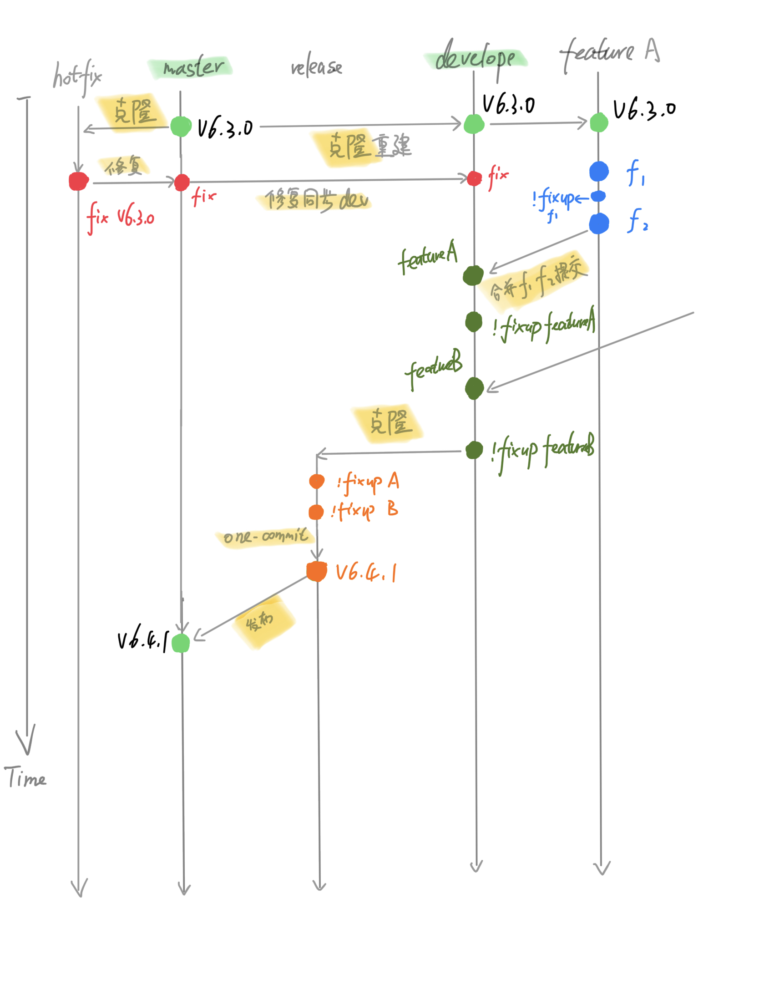

### gitflow


#### 分支管理

> master 生产主分支,发布到生产环境使用这个分支,由 hotfix 或者 release 分支合并过来，不直接提交代码。

> develop 主开发分支 , 基于 master 分支克隆，由 feature 分支合并过来，一般不直接提交代码。

> feature 功能开发分支 , 基于 develop 分支克隆 , 主要用于新需求新功能的开发，同时存在多个。

> release 预发布分支 , feature 分支合并到 develop 之后 , 从 develop 分支克隆，测试完成后合并到 master 并打上版本号，同时也合并到 develop。

> hotfix 补丁分支 , 基于 master 分支克隆 , 主要用于对线上的版本进行 BUG 修复,完成后合并到 master 分支和 develop 分支,并打上版本号。

[git flow 详细](https://juejin.cn/post/6844903997589946382)

> 

### One-Commit 原则

痛点：

> 开发中，代码需要多次在不同分支之间进行同步，如果不对 commit 进行管理，会发现操作繁琐、冲突频发，还可能发生遗漏问题。
> 目标：
> 希望做到任意场景下，每次 cherry-pick 只需拣 1 个 commit，绝不出现需要拣 2 个及以上 commits 的情况，姑且称为『One-Commit』。这样可以将代码同步的心智负担和错漏风险降到最低，分支的提交记录也会非常整洁。

基本思路:

> 为了实现『One-Commit』的目标，需要借助一些 git 命令.
> 首次提交时，写明需求的总体内容，称为『基准提交』（很重要，后面会一直用到）；
> 从第二个提交开始，可按照下面三个思路任选一个。

```
// 思路1
git commit -m 'feat(设备):设备模块'
git commit --amend

// 思路2
git commit -m 'feat(设备):设备模块'
git commit --fixup <commit>
git rebase -i --autosquash <commit>

// 思路3
git commit -m 'feat(设备):设备模块'
git commit -m 'feat(设备):新建设备'
git commit -m 'feat(设备):编辑设备'
git rebase -i  <commit>

```

### git 提交规范

看一下 commit message 的格式：

```
<type>(<scope>): <subject>
<BLANK LINE>
<body>
<BLANK LINE>
<footer>
```

我们可以发现，commit message 分为三个部分(使用空行分割):

标题行（subject）: 必填, 描述主要修改类型和内容。
主题内容（body）: 描述为什么修改, 做了什么样的修改, 以及开发的思路等等。
页脚注释（footer）: 可以写注释，放 BUG 号的链接。

以下为规范的 type 类型：

```
feat: 新增产品功能
fix: 修复 bug
docs: 文档的变更
style: 不改变代码功能的变动(如删除空格、格式化、去掉末尾分号等)
refactor: 重构代码。不包括 bug 修复、功能新增
perf: 性能优化
test: 添加、修改测试用例
build: 构建流程、外部依赖变更，比如升级 npm 包、修改 webpack 配置
ci: 修改了 CI 配置、脚本
chore: 对构建过程或辅助工具和库的更改,不影响源文件、测试用例的其他操作'
revert: 回滚 commit
```

当然，我们可以通过工具，可以很好的管理团队成员的 git commit 格式，无需使用人力来检查。`husky`可以在 package.json 里配置 git hook 脚本,能在重要动作发生时触发自定义脚本。

### 产品发布版本号规则描述

> 规范产品发布版本号为 V A.B.C.D，其中：

- A：产品发布的年份，从 0 开始计、向上递增
  例如，产品于 2016 年首次发布、记为 0，2017 年为 1，2022 年即为 6

- B：主版本发布月份
  主版本为新增/变更主线功能/主线交互/系统架构等的主推版本，即主要功能升级版本，约一月一次发布，以实际排期、版本号编写为准。
  例如，产品 3.0 初次于 2022/2/23 发布生产环境，2 月发布即为 2

- C：当月主版本发布后、下一次主版本发布前的子版本发版次数，从 0 开始计、向上递增
  子版本为主版本发布后的增补/遗留支线功能/修复发布，不定期，以实际排期、版本号编写为准。
  例如，产品 3.0 初次于 2022/2/23 发布生产环境，为一次主版本发布，子版本发布次数记为 0，产品发布版本号为 V6.2.0.0；若 2022/2/25 发布部分增补功能至生产环境，为一次子版本发布，子版本发布次数记为 1，发布版本号即为 V6.2.1.0

- D：主/子版本发布之余的 Hotfix 次数，从 0 开始计、向上递增；其中，子版本发布后，Hotfix 次数清 0
  Hotfix 为修复类发布，不定期，以实际情况为准。
  例如，产品 3.0 初次于 2022/2/23 发布生产环境，产品发布版本号为 V6.2.0.0；若 2022/2/24 发布修复类代码至生产环境，为一次 Hotfix 发布，Hotfix 发布次数记为 1，版本号即为 V6.2.0.1；若 2022/2/25 发布部分增补功能至生产环境，为一次子版本发布，子版本发布次数记为 1，产品发布版本号即为 V6.2.1.0，此时 Hotfix 次数清 0
