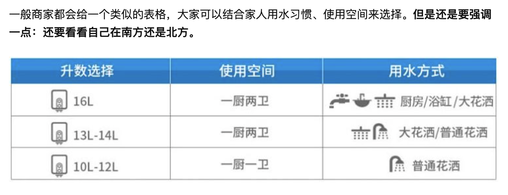

### 燃气热水器

    一线品牌主要有林内、能率等国际一线品牌
    二线品牌主要为海尔、美的、万和、万家乐等国产品牌

> 一线品牌价格较高，一般 2000 起步，虽然技术相对先进，但是性价比较国产品牌低不少。如今一些国产品牌做的也相当不错，而且性价比高。

#### 重要指标对比

1. 燃气出水量
   燃热出水量也称容量，是衡量燃气热水器供给热水能力的指标。指每分钟能使多少升的水温升高 25℃。比如 16L 就是指每分钟可以使 16L 升的水升温 25 度。

   

   北方冬季气温低，进水温度也较低，如果想加热至理想的沐浴水温，冷水温度上升幅度远不止 25℃，燃气热水器容量选的偏小同样会造成出水温度不够。所以北方地区的用户需要也需要将容量选的偏大点，反之，南方地区可选的稍微小点。

2. 控温方式

   > 就控温效果来说，一般仅燃气比例阀＜水气双调＜水量伺服器。实际上一般水温波动范围在 ±1℃ 内时人体并没有什么感觉，质量好点的水气双调就完全够用了

   对于控温效果，不能仅仅只关注平稳用水时的恒温效果，还应关注中途停水后再次开启和刚打开热水器时的水温问题。即下面讲到的旁通混水和零冷水。

   - 旁通混水
     一定要有。
     燃气热水器会有停水温升现象，我们在洗澡的过程中经常会遇到一种工况：先打开热水器冲一会身体，然后关了莲蓬头涂沐浴露搓澡，再打开莲蓬头将身体冲干净。中间停水时虽然热水器没有继续工作，但是已经被烧热的换热器会持续对停留在其中的水进行加热，再次使用时流出的热水温度可能会明显高了很多。此时可能会造成烫伤，也有可能因为惊吓造成在浴室内跌倒。对于这个问题，其实解决方法也很简单，增加一根旁通管即可，也就是我们常说的旁通混水。
   - 零冷水
     零冷水指的就是通过一定的技术手段使得打开燃气热水器时便可直接流出热水，不必等待冷水流完后再流出热水。如果没有安装回水管，建议不要购买零冷水燃气热水器。如果本来没有安装回水管，使用零冷水燃气热水器会造成马桶、洗衣机等地方的冷水管也会出热水，不但会造成浪费，而且冷水管中长期通热水，会加速管道的老化，还有安全隐患。

3. 安装方式
   安装方式的不同只要是指燃气热水器燃烧时所需氧气的来源和尾气排放的位置不同，市面上在售的主要为强排式和平衡式两种。强排式燃烧所需的氧气来自室内，尾气通过高速风机强行排至室外；平衡式燃烧所需氧气来自室外，尾气也排至室外。
   > 强排式是主流，但平衡式可安装在橱柜、浴室等密闭空间内，当然平衡式也会更贵。特别需要注意的是有些城市的燃气公司是不允许燃气管道接到浴室的，如果有购买平衡式燃气热水器安装在浴室中意愿的朋友请先咨询当地燃气公司，以免买回去后不能按原计划安装。
4. 热交换器材质
   热交换器材质主要影响热水器的加热效率和耐久性。热交换器材质优先选择铜的，但是无氧铜和磷脱氧铜区别并不大，没必要在这二者之间纠结。
5. 能效等级
   二级能效和一级能效的综合使用成本相差并不多，不用纠结。
   一般一级能效都是冷凝式，虽然更节省天然气，但是价格也贵了不少。从综合成本来看，二者相差不大。
6. 关于售后
   - 安装材料能自己购买就自己购买，安装师傅带的材料都是天价；
   - 三线及以下城市、特别是小县城，最好别购买像能率、林内这种国际一线品牌，小城市安装、售后比较麻烦。

#### 热水器推荐

海尔 JSQ31-16JM6(12T)

- 16L 容量
- 强排式
- 水量伺服器
- 加厚磷脱氧铜换热器
- 旁通混水
- 上置变频风机
- ￥ 1299（京东：1879）

> 16L 的容量可满足大部分一厨两卫家庭使用，换热器材质为加厚磷脱氧铜，1000 多的价格便搭载了水量伺服器，出水水温波动可控制在 ±0.1℃ 范围内。虽然是上置风机，但使用的是直流变频风机，转速为 500~5000 转/min 可调，大大提升了热水器的抗风能力。这款热水器使用了旁通混水技术，关闭后再次打开使用时水温温升小于 1℃，大大提升了用水体验，也提高了热水器的安全性。

美的 JSQ30-MK3

- 16L 容量
- 强排式
- 水量伺服器
- 无氧铜铜换热器
- 火力自动切换，自动调节火排数量
- 银离子抑菌
- 上置变频风机
- 整机 8 年保修
- ￥ 1199（京东：1399）

> 同样和上面这款海尔燃气热水器对标的产品。和上面这款海尔的燃气热水器类似，差不多的价格，配置也大同小异。控温方式同样采用了水量伺服器，同样也是采用了上置的直流变频风机。相比海尔的竞品，这款热水器增加了银离子抑菌。
